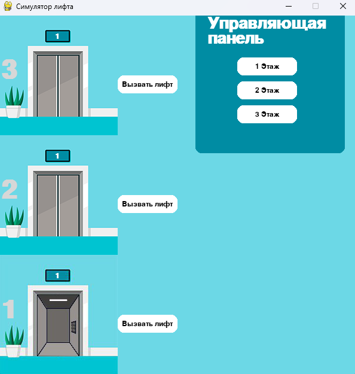

# Симулятор лифта на pygame

Сначала укажите, сколько этажей будет обслуживать лифт (не советую брать больше 7, т.к. окно получится слишком большим в высоту, а pygame не умеет в прокрутку). 

Это запустит pygame, который нарисует ваши этажи, лифт и кнопки:

Слева расположены кнопки на этажах, справа вверху - панель с кнопками внутри лифта.

Лифт перемещается между этажами по простой схеме, как лифт у вас дома: 
- Едем вверх - игнорируем любые вызовы по пути.
- Едем вниз - собираем всех пассажиров.

Спасибо за внимание и хорошего дня!